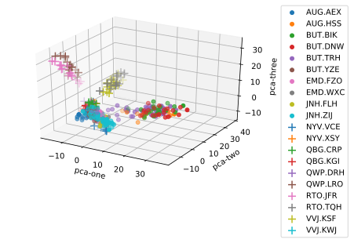

Classifications par apprentissage
==============

***Examen mi-parcours -- M2SSD UE Analyse de données***

**Élèves:** *Jah Sylla Camara, François-Rémi Mazy*

# Exercice 1

blablabla

---

# Exercice 2

## Présentation des données

Les données contenues dans le fichier `train-data.txt` ont la forme d'une matrice indiquant pour 417 individus son espèce ainsi que les valeurs de 1300 descripteurs (réels positifs). Le but du travail est d'inférer les espèces à partir des descripteurs.

Nous observons certains descripteurs présentant des valeurs non-attribuées (NA). Nous faisons alors le choix de ne pas prendre en compte ces colonnes ce qui réduit la matrice des descripteurs à 1275 colonnes.

Enfin, nous réalisons un encodage numérique des 20 espèces décrites initialement sous forme textuelle.

## Analyse exploratoire par visualisation

### Réduction dimensionnelle par PCA

#### Principe

La méthode PCA (*Principal component analysis*) est une technique visant à réduire le nombre de dimensions d'une base de données en retenant uniquement les informations utiles. Elle consiste en une corrélation et fournit un nombre minimum de variables qui conserve la valeur maximale de variation à propos de la distribution de l'information. Mathématiquement, cette méthode passe par les valeurs propres de la matrice de covariance qui indiquent les directions de variation maximale.

#### Application

Nous appliquons la méthode PCA fournie par `scikit-learn` sur la matrice des descripteurs. Dans un soucis de visualisation, nous nous limitons à trois directions de variation maximale.

Nous obtenons que ces trois directions comptent pour 17% des variations de la totalité des données. Il s'agit maintenant d'observer si certaines espèces se distinguent des autres dans cet espace à trois dimensions de manière à former des groupes (clusters).

---